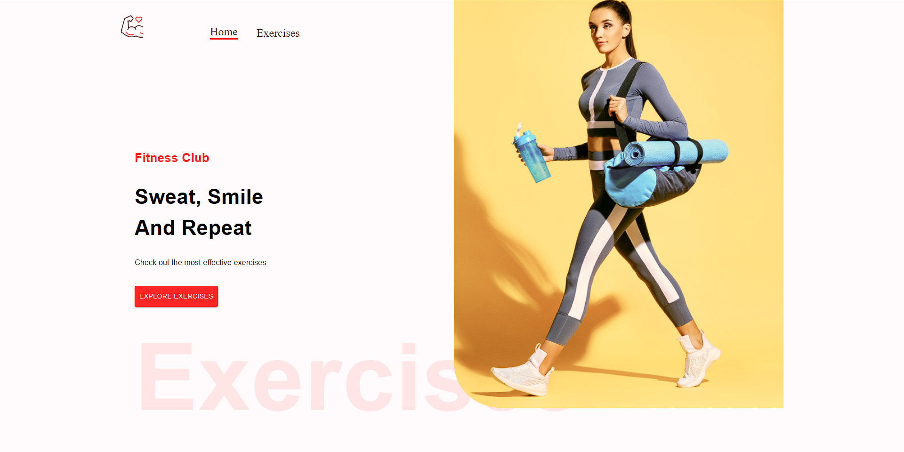
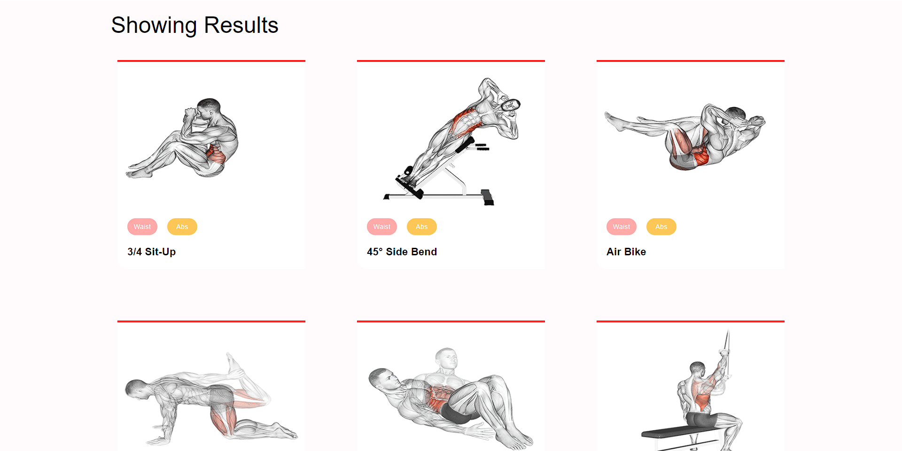
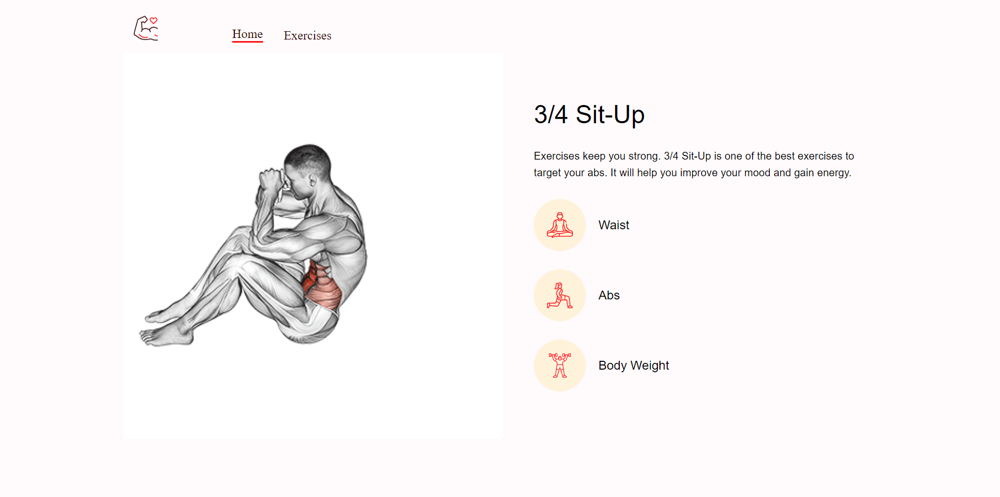
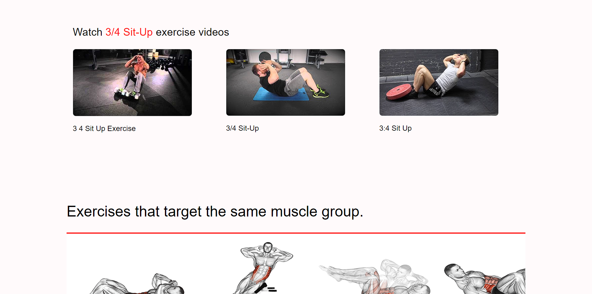

# Golds Gym

React Responsive Gym app developed with Material Ui and Rapid API

 
 

## Access the app: https://gld-gym.netlify.app

 

## Run the project
 
Git clone
<pre>
    git clone git@github.com:martsDev/Golds-Gym.git
</pre>

 

Access project directory
<pre>
    cd Golds-Gym
</pre>

 

Run npm install
<pre>
    npm install
</pre>

 

Config the .env
<pre>
    See .env.example file inside project diretory
</pre>

 

Run the project
<pre>
    npm start
</pre>